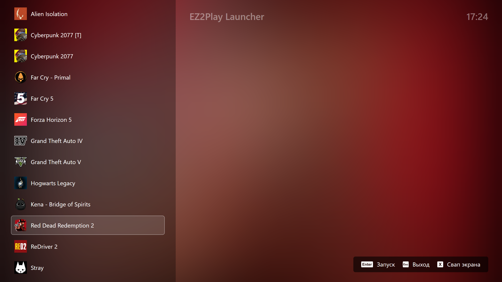

# EZ2Play



  

EZ2Play - простой лаунчер игр для Windows с полноэкранным интерфейсом. Работает из папки с ярлыками без дополнительных настроек. Все что нужно для использования - ваши ярлыки игр.

## Возможности

- **Управление с геймпада либо клавиатуры**
- **Быстрое переключение экрана** - опция доступна при наличии двух и более экранов
- **Никаких настроек** - просто поместите ваши ярлыки в папку `shortcuts`
- **Лаконичный дизайн**

## Использование

1. Создайте папку `shortcuts` рядом с `EZ2Play.exe`
2. Поместите ярлыки игр в папку `shortcuts`
3. Запустите `EZ2Play.exe`

### Управление
- **Навигация**: ↑/↓ или D-pad
- **Запуск**: Enter или кнопка A
- **Выход**: Escape или кнопка B
- **Смена дисплея**: X или кнопка X (при нескольких мониторах)

## ⚙️ Параметры командной строки

```bash
EZ2Play.exe [параметры]
```

| Параметр | Описание |
|----------|----------|
| `--nosplash` | Запуск без экрана-заставки |
| `--log` | Включение детального логирования |
| `--hotswap` | Автоматическое переключение дисплея при запуске |

**Примеры:**
```bash
# Запуск без заставки
EZ2Play.exe --nosplash

# Запуск с логированием
EZ2Play.exe --log

# Быстрое переключение дисплея
EZ2Play.exe --hotswap
```

## Системные требования

- Windows 10/11
- .NET Framework 4.7.2+
