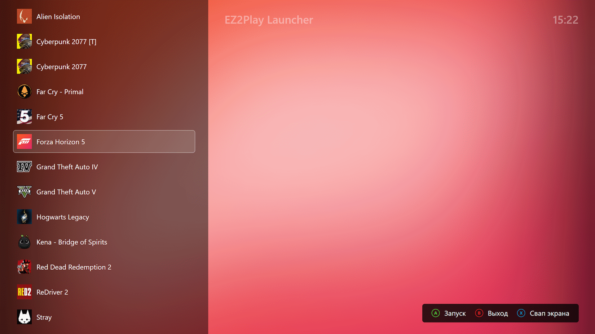
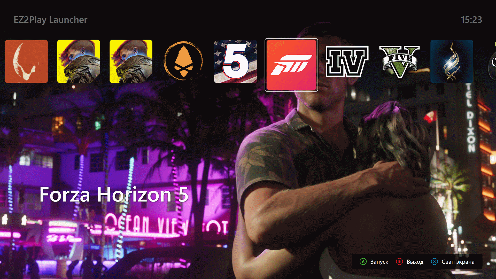

# EZ2Play Launcher




  

EZ2Play - это простой WPF лаунчер без каких-либо настроек, который позволяет запускать игры и приложения с помощью простых ярлыков.

## Возможности

- **Два режима отображения** - вертикальный (список) и горизонтальный (обложки)
- **Управление с геймпада либо клавиатуры**
- **Быстрое переключение экрана** - опция доступна при наличии двух и более экранов
- **Мультиязычность** - поддержка русского и английского языков
- **Никаких настроек** - просто поместите ваши ярлыки в папку `shortcuts`
- **Гибкая кастомизация** - через [аргументы командной строки](#️-параметры-командной-строки)

## Использование

1. Запустите `EZ2Play.exe` (папка `shortcuts` создастся автоматически)
2. Поместите ярлыки игр в папку `shortcuts`
3. Приложение готово к работе

### Кастомизация (опционально)

Для дополнительной настройки внешнего вида поместите файлы рядом с `EZ2Play.exe`:

- **`logo.png`** - кастомное изображение логотипа для заставки (используется с `--logo`)
- **`bg.jpg` или `bg.png`** - кастомный фон приложения (используется с `--bg`)

## ⚙️ Параметры командной строки

```bash
EZ2Play.exe [параметры]
```

### Основные параметры

| Параметр | Описание |
|----------|----------|
| `--nosplash` | Запуск без экрана-заставки |
| `--log` | Включение детального логирования |
| `--swap` | Автоматическое переключение дисплея при запуске и обратно при выходе |
| `--wide` | Запуск в горизонтальном режиме (обложки) вместо вертикального (список) |
| `--eng` | Запуск на английском языке (по умолчанию русский) |

### Кастомизация

| Параметр | Описание |
|----------|----------|
| `--bg` | Использовать `bg.jpg` или `bg.png` как фон вместо динамического |
| `--logo` | Использовать `logo.png` вместо названия приложения |
| `--logo-Текст` | Заменить название приложения на кастомный текст или фразу |
| `--slogan-Текст` | Заменить слоган на кастомный текст или фразу |

> **Примечания:**
> - При использовании кириллицы в batch файлах добавьте в начало `chcp 65001 >nul` для корректной кодировки
> - В кастомных текстах и фразах используйте **кавычки с пробелами**: `--logo-"Мой логотип"` или `--slogan-"Пожалуйста, подождите..."`

### Примеры использования

```bash
# Запуск в горизонтальном режиме (обложки)
EZ2Play.exe --wide

# Быстрое переключение дисплея без заставки
EZ2Play.exe --swap --nosplash

# Горизонтальный режим с кастомным фоном
EZ2Play.exe --wide --bg

# Кастомная заставка с изображением лого
EZ2Play.exe --logo

# Кастомные тексты с пробелами
EZ2Play.exe --logo-"WinStation Pro" --slogan-"Пожалуйста, подождите..."

# Комбинирование параметров
EZ2Play.exe --wide --bg --logo --slogan-"Пожалуйста, подождите..."
```

## Системные требования

- Windows 10/11
- .NET Framework 4.7.2+

## Сборка из исходного кода

**Требования:**
.NET Framework 4.7.2 Developer Pack

```bash
dotnet restore
dotnet build --configuration Release
```

**Зависимости:**
- SharpDX.DirectInput (для поддержки геймпадов)

## Лицензия

Этот проект распространяется под лицензией MIT - подробности в файле [LICENSE](LICENSE).
