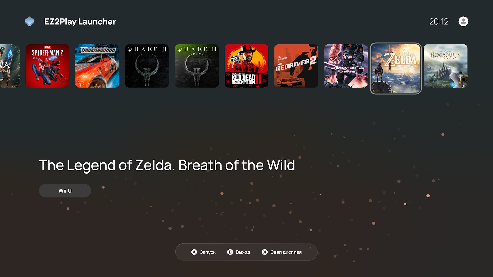
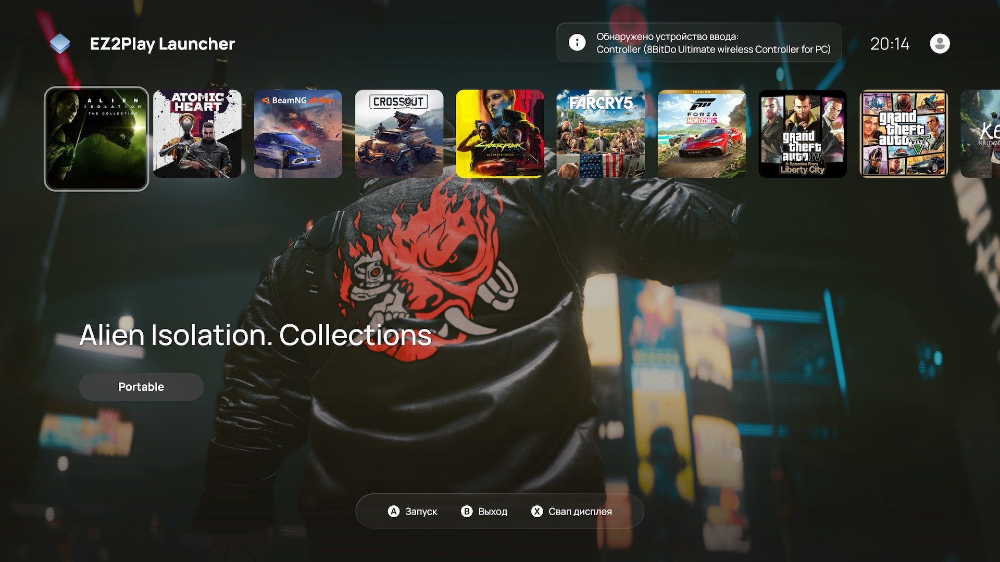
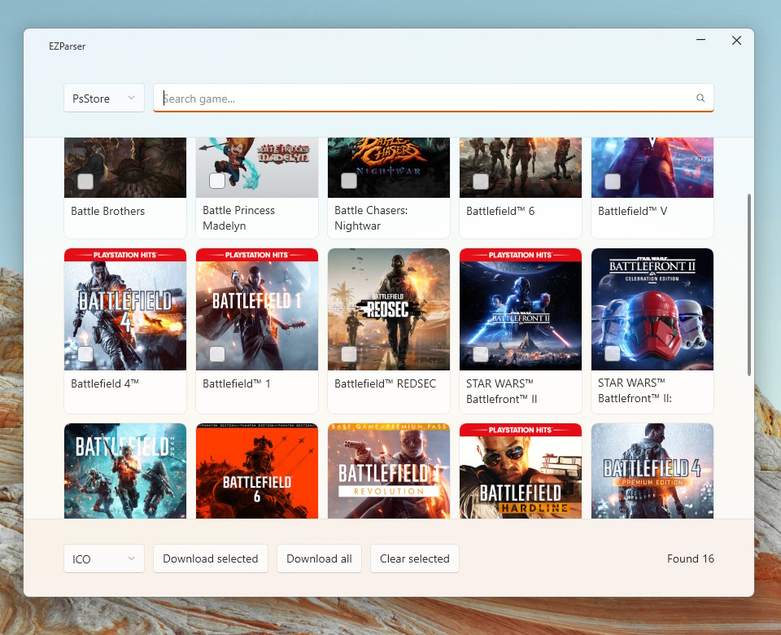
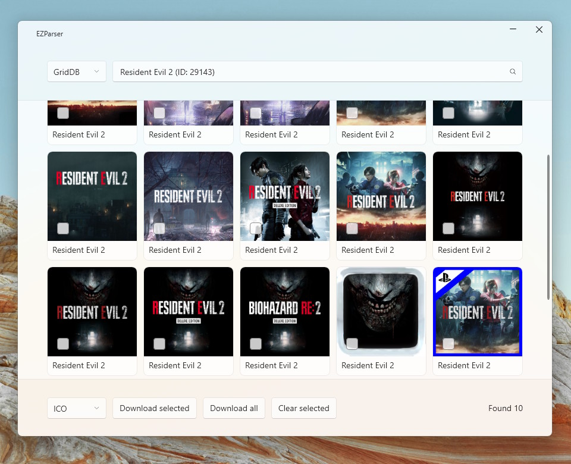

# EZ2Play Launcher

[](https://github.com/free-gen/EZ2Play/releases/latest)
[](https://dotnet.microsoft.com)
[](https://wpfui.lepo.co/)

EZ2Play is a minimalistic game launcher for those who value simplicity and a lack of unnecessary settings. Its logic is based on using standard Windows shortcuts, which already contain everything you need: the game path, launch options, and an .ico icon as a cover. The launcher allows you to control games with a gamepad and quickly switch between your monitor and TV, making playing on a large screen as convenient as possible.




## Features

- **Home/Guide button handler** - return to the launcher from any game by pressing one button
- **Quick screen switching** - the option is available if you have two or more screens
- **Multilingual support** - support for Russian and English languages
- **No settings required** - just place the shortcuts in the `shortcuts` folder
- **WPF-UI** - full support for Windows 11 styles

## Usage

1. Download and run `EZ2Play.exe`
2. Place game shortcuts (.lnk and .url) in the `shortcuts` folder (created automatically)
3. Optionally, you can use `EZParser` to customize shortcuts
4. The launcher is ready to use

## Customization

EZ2Play supports custom sounds, background images, and launch logos.
To do this, use the `ui.pack` file in the launcher folder.

#### Creating a ui.pack

1. Prepare the required files (see the composition below).
2. Pack them into the archive `ui.zip` (without subfolders, the files should be in the root).
3. Rename the archive `ui.zip` to `ui.pack`.

#### Package contents

- `logo.png` - splash screen logo
- `bg.png` or `bg.jpg` - background image
- `select.mp3` - movement sound
- `action.mp3` - start sound
- `abort.mp3` - return sound
- `ambient.mp3` - background music

> **Note:** If the `ui.pack` file is missing or does not contain any resources, the built-in default value is used.

## Custom Game Source

EZ2Play allows you to set a custom game source name using the "Comment" field in the `.lnk` shortcut.

- In the shortcut properties, find the Comment. field.
- Enter any value there, and it will be displayed in the game source card in EZ2Play.

This is useful for marking games that are launched using emulators.

> **Note:** If the Comment field is empty, EZ2Play uses the default value (Portable).

## Command Line Args

```bash
EZ2Play.exe [arg]
```

| Arg            | Description |
|----------------|-------------|
| `--nosplash`   | Launch without a splash screen |
| `--hotswap`    | Automatically switches the display when started and returns the original display when closed |
| `--nomusic`    | Turns off background music |

### Samples

```bash
# Launching without a splash screen
EZ2Play.exe --nosplash

# Launching with automatic display switching
EZ2Play.exe --hotswap

# Launching without background music
EZ2Play.exe --nomusic

# Combinations
EZ2Play.exe --hotswap --nosplash --nomusic
```

# EZParser Auxiliary application




Allows you to quickly find game covers and save them in icon format using the built-in `.png → .ico` converter. Supports **PsStore** and **SteamGridDB**.

> SteamGridDB requires an API key

## System requirements

- Windows 10 / 11
- .NET Framework 4.8

## Build from source code

To build the project, use the .NET SDK:
```bash
dotnet build --configuration Release
```

## Support the project

**You can use crypto or rubles:**

[](https://finance.ozon.ru/apps/sbp/ozonbankpay/019993bb-a466-72de-bc2c-e7ee85abc8a6)
[](https://tronscan.org/#/address/TZD9FhF1ZusMCN2XfSQrb2jpRBk7YTCzUy)

## License

The project is distributed under the **MIT** license. For more information, see the [LICENSE](LICENSE) file.
