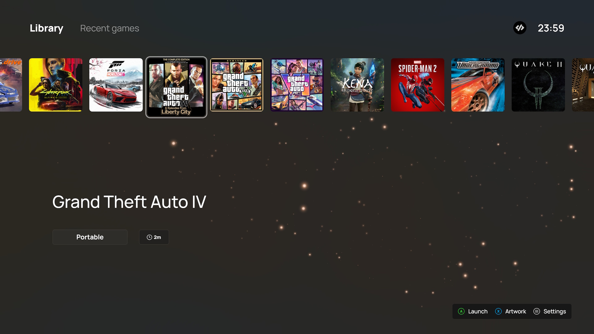
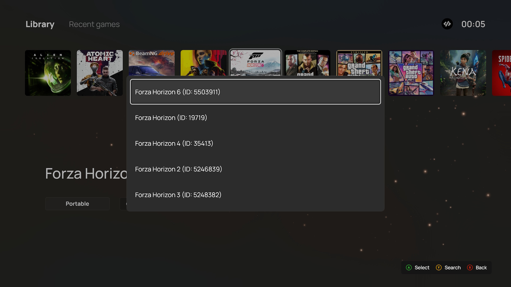

#  EZ2Play Launcher

[](https://github.com/free-gen/EZ2Play/releases/latest)
[](https://dotnet.microsoft.com)
[](https://wpfui.lepo.co/)

EZ2Play is a minimalistic portable game launcher for Windows focused on gamepad control, simple shortcut-based game management, and fast switching between a monitor and TV.

Instead of scanning installed games or maintaining its own library database, EZ2Play uses standard Windows `.lnk` and `.url` shortcuts. Put the shortcuts you want into the `shortcuts` folder and the launcher builds the library from them.




## Features

- **Gamepad-first interface** - navigate and launch games using an XInput-compatible controller
- **Home/Guide button handling** - close the current foreground game or application and return to the launcher when Xbox Game Bar is unavailable
- **Quick display switching** - switch between the default and external display from Settings on systems with multiple displays
- **HotSwap mode** - automatically switch to an external display on launch and return to the internal display when EZ2Play exits
- **Recent Games** - sort games by the last successful launch
- **Playtime tracking** - keeps lightweight playtime metadata for launched games
- **Built-in artwork search** - find square game covers through SteamGridDB
- **Custom covers** - use your own PNG, JPG, or JPEG artwork
- **Multilingual interface** - 🇬🇧 🇷🇺 🇩🇪 🇫🇷 🇨🇳
- **No game scanning** - the library is entirely based on files in the `shortcuts` folder
- **Portable design** - shortcuts, covers and optional UI resources stay with the launcher
- **WPF-UI** - Windows 11-style interface
- **EZ2Play Helper** - optional background process for launching EZ2Play with the Home/Guide button

## Xbox Game Bar

EZ2Play checks whether Xbox Game Bar is installed.

When Xbox Game Bar is available, EZ2Play does not intercept the Home/Guide button for its own foreground-window closing behavior. The Guide button remains available to the native Xbox Game Bar interface.

Display switching and HotSwap remain EZ2Play features and are independent of the Guide handler.

## Usage

1. Download or build `EZ2Play.exe`.
2. Place `EZ2Play Helper.exe` next to it if you want Guide-button background launching.
3. Run `EZ2Play.exe`.
4. Place game shortcuts (`.lnk` or `.url`) in the automatically created `shortcuts` folder.
5. Launch games directly from the EZ2Play library.

The launcher is designed to run as a portable application from a writable folder.

## Game Covers

Custom covers are stored in:

```text
shortcuts/covers
```

Supported custom image formats:

```text
.png
.jpg
.jpeg
```

The file name must match the shortcut file name.

Example:

```text
shortcuts/
  Cyberpunk 2077.lnk

shortcuts/covers/
  Cyberpunk 2077.png
```

## Built-in Artwork Search

EZ2Play includes an integrated SteamGridDB artwork browser.

It can:

- search SteamGridDB for the selected game;
- show artwork previews;
- download the selected original artwork;
- crop and save it as a 512×512 PNG cover;
- refresh the selected game immediately after saving.

The resulting file is stored in:

```text
shortcuts/covers
```

### SteamGridDB API key

SteamGridDB requires an API key.

EZ2Play checks for a key in this order:

1. the embedded key in `ParserOverlay.xaml.cs`;
2. `SteamGridDbApiKey` in the EZ2Play configuration.

An embedded key has priority when both are present.

For builds from the public source code, the embedded key may be empty. In this case add your own SteamGridDB key to:

```text
%APPDATA%\EZ2Play\config.json
```

Example:

```json
{
  "SteamGridDbApiKey": "YOUR_STEAMGRIDDB_API_KEY"
}
```

Other configuration fields may also be present in the file. They do not need to be removed.

If no key is configured, EZ2Play displays a localized configuration message instead of treating the request as an empty search result.

## Custom Game Source

EZ2Play can display a custom source name for `.lnk` shortcuts.

Open the shortcut properties and enter the desired source name in the **Comment** field.

For example:

```text
PCSX2
RPCS3
Emulator
Portable
```

If no source information can be detected, EZ2Play uses `Portable`.

## Settings

The Settings overlay provides:

- enable or disable launching EZ2Play through the Home/Guide button;
- automatically configure EZ2Play Helper in Windows startup;
- enable or disable FPS Monitor integration when FPS Monitor is installed;
- switch between displays on systems with multiple monitors;
- exit EZ2Play.

When Helper autorun is enabled, the following launch options can also be configured:

- `--nosplash`
- `--nomusic`
- `--hotswap`

## Command Line Arguments

```text
EZ2Play.exe [arguments]
```

| Argument | Description |
| --- | --- |
| `--nosplash` | Skip the startup splash screen |
| `--hotswap` | Switch to the external display on launch and restore the internal display on exit |
| `--nomusic` | Disable background music |

Arguments can be combined:

```text
EZ2Play.exe --hotswap --nosplash --nomusic
```

## EZ2Play Helper

`EZ2Play Helper.exe` is an optional background companion process.

When enabled from Settings it:

- runs in the background;
- is added to Windows startup;
- monitors XInput controller slots 0-3;
- launches EZ2Play when the Home/Guide button is held;
- forwards the configured EZ2Play launch arguments.

Only one Helper instance is allowed to run at a time.

## UI Customization

EZ2Play supports an optional `ui.pack` file placed next to the launcher.

It can override the built-in:

- splash logo;
- background image;
- movement sound;
- launch sound;
- back sound;
- ambient music.

### Creating `ui.pack`

1. Prepare the desired files.
2. Put them directly in the root of a ZIP archive.
3. Rename the archive from `ui.zip` to `ui.pack`.

Supported entries:

```text
Logo.png
Bg.png
Bg.jpg
Focus.mp3
Invoke.mp3
Back.mp3
Ambient.mp3
```

Missing entries automatically fall back to the built-in resources.

## System Requirements

- Windows 10 or Windows 11
- Windows 11 24H2 or later is required for the gamepad on-screen keyboard; on Windows 10 this feature is unavailable
- .NET Framework 4.7.2 or newer compatible .NET Framework 4.x runtime
- XInput-compatible controller for gamepad features

## Build from Source

EZ2Play uses normal `dotnet` project builds. Visual Studio and a solution file are not required.

From the repository root:

```powershell
dotnet build "src/EZ2Play/EZ2Play.csproj" -c Release
dotnet build "src/EZ2Play Helper/EZ2Play Helper.csproj" -c Release
```

For a diagnostic build:

```powershell
dotnet build "src/EZ2Play/EZ2Play.csproj" -c Debug
```

Debug builds can write diagnostic information to:

```text
%APPDATA%\EZ2Play\debug.log
```

Diagnostic log calls are compiled out of Release builds.

## Support the Project

**You can use crypto or rubles:**

[](https://finance.ozon.ru/apps/sbp/ozonbankpay/019993bb-a466-72de-bc2c-e7ee85abc8a6)
[](https://tronscan.org/#/address/TZD9FhF1ZusMCN2XfSQrb2jpRBk7YTCzUy)

## License

EZ2Play is distributed under the **MIT License**. See [LICENSE](LICENSE) for details.