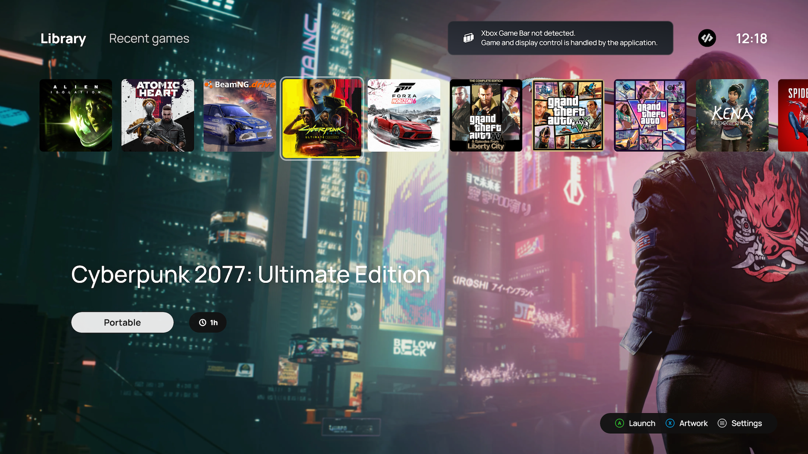
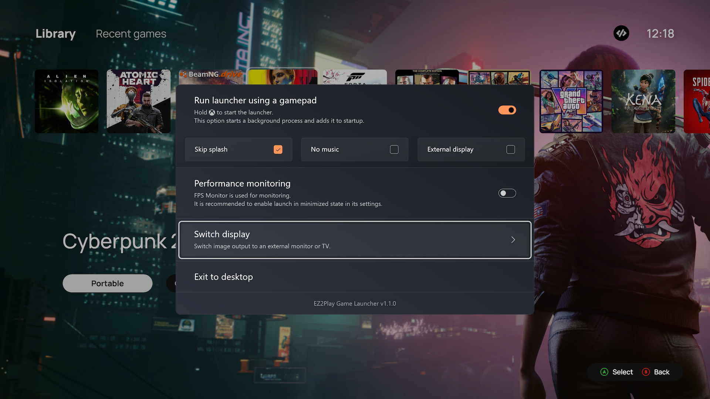
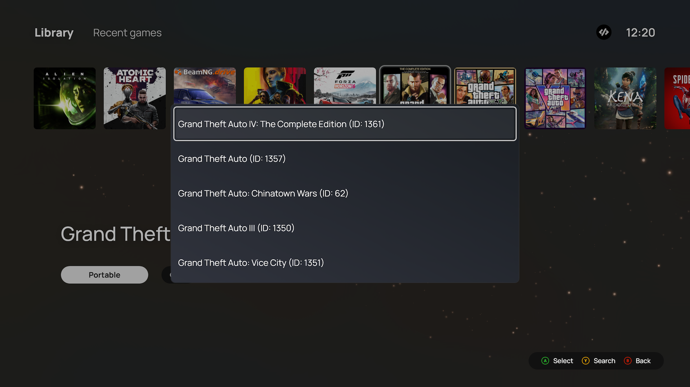
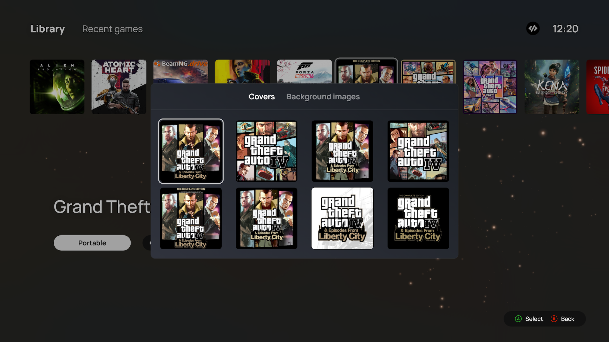
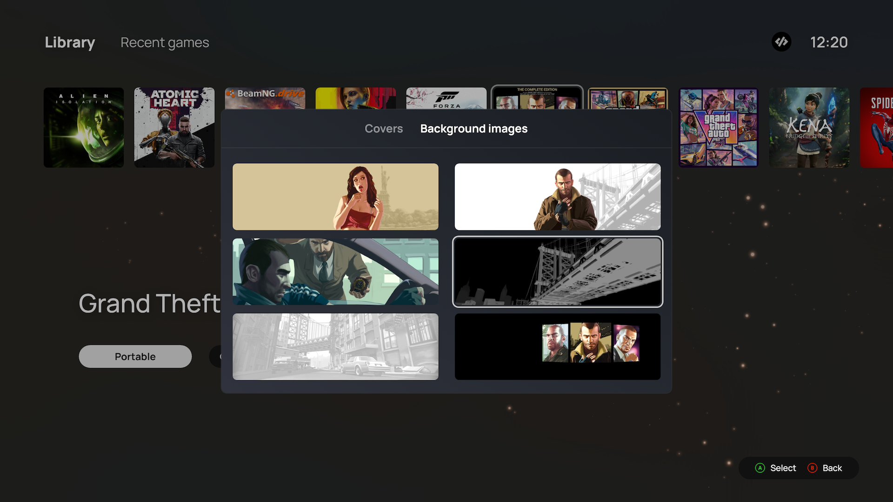
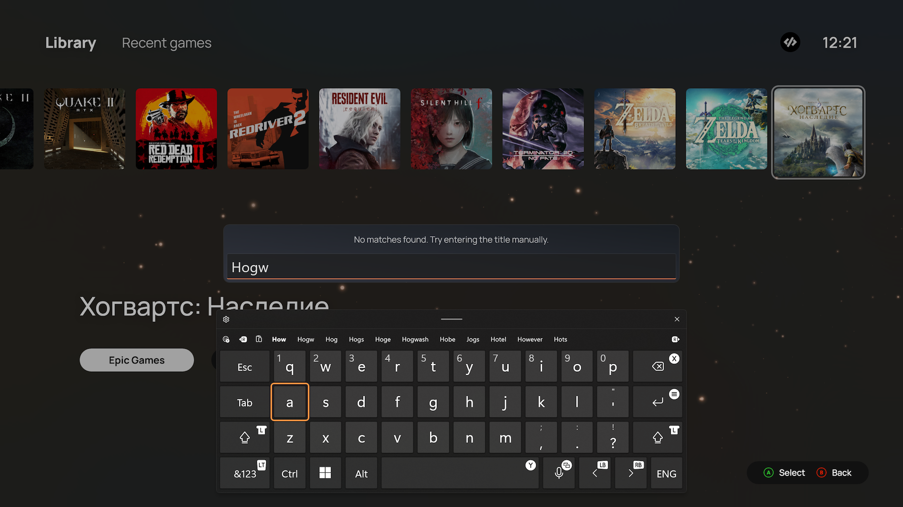

#  EZ2Play Launcher

[](https://github.com/free-gen/EZ2Play/releases/latest)
[](https://dotnet.microsoft.com)
[](https://wpfui.lepo.co/)

EZ2Play is a minimalistic portable fullscreen game launcher for Windows focused on gamepad control, shortcut-based libraries, custom artwork and quick switching between a monitor and TV.

Instead of scanning Steam, Epic Games or installed applications, EZ2Play uses standard Windows `.lnk` and `.url` shortcuts.




## Features

- **Gamepad-first interface** with XInput controller support
- **Shortcut-based library** using `.lnk` and `.url`
- **Gamelist / Last Played** library tabs
- **Lightweight playtime tracking**
- **SteamGridDB artwork browser**
- **Square game covers**
- **Per-game background images**
- **Animated particle fallback** for games without backgrounds
- **Smooth background crossfade and horizontal pan**
- **Custom PNG / JPG / JPEG artwork**
- **Quick display switching**
- **HotSwap mode** for monitor / TV setups
- **Xbox Guide button support**
- **Optional EZ2Play Helper**
- **FPS Monitor integration**
- **Custom UI sounds and ambient music through `ui.pack`**
- **English, Russian, German, French and Simplified Chinese**
- **Portable game library**

## Usage

1. Download or build `EZ2Play.exe`.
2. Run it from a writable folder.
3. Put game shortcuts into the automatically created `shortcuts` folder.
4. Optionally place `EZ2Play Helper.exe` next to the launcher for background Guide-button launching.

Example:

```
EZ2Play/
  EZ2Play.exe
  EZ2Play Helper.exe

  shortcuts/
    Cyberpunk 2077.lnk
    Elden Ring.url
```

## Game Artwork

Artwork is stored next to the portable library.

```
shortcuts/
  Cyberpunk 2077.lnk

  covers/
    Cyberpunk 2077.png

  backgrounds/
    Cyberpunk 2077.jpg
```

Supported formats:

```
.png
.jpg
.jpeg
```

The artwork file name must match the shortcut file name without `.lnk` or `.url`.

## SteamGridDB Artwork Browser






Select a game and open the built-in artwork browser to search SteamGridDB.

It contains two asset tabs:

- **Covers**
- **Background images**

`LB` and `RB` switch between them when using a controller.

### Covers

EZ2Play searches for square `512x512` and `1024x1024` artwork.

The selected image is downloaded, cropped when necessary and saved as a `512x512` PNG in:

```
shortcuts/covers
```

### Backgrounds

Backgrounds use SteamGridDB Heroes with wide `3840x1240` artwork.

The selected original image is saved without cover-style cropping or resizing in:

```
shortcuts/backgrounds
```

The new background becomes available without restarting EZ2Play.

## Dynamic Backgrounds

When the selected game has a custom background, EZ2Play displays it behind the main interface.

Backgrounds:

- preserve their aspect ratio;
- fit the viewport height;
- slowly pan horizontally when wider than the screen;
- crossfade when the selected game changes.

If no custom background exists, EZ2Play displays the animated particle background.

## SteamGridDB API Key

EZ2Play first uses its configured application API key and falls back to:

```
%APPDATA%\EZ2Play\config.json
```

Example:

```json
{
  "SteamGridDbApiKey": "YOUR_STEAMGRIDDB_API_KEY"
}
```

If no valid key is available, the artwork browser displays a localized configuration error.

## Custom Game Source

For `.lnk` shortcuts, EZ2Play can display a custom source name.

Open the shortcut properties and enter the desired source into the **Comment** field.

Examples: `Steam` `PCSX2` `RPCS3` `Emulator` `Portable`

If no source can be detected, EZ2Play uses `Portable`.

## Xbox Game Bar and Guide Button

EZ2Play checks whether Xbox Game Bar is installed.

When Xbox Game Bar is available, the Guide button remains controlled by Windows and Game Bar.

When Game Bar is unavailable, EZ2Play can use its own Guide-button behavior to close the current foreground application and return to the launcher.

Display switching and HotSwap work independently from Game Bar.

## EZ2Play Helper

`EZ2Play Helper.exe` is an optional background companion.

When enabled from Settings it:

- can start with Windows;
- monitors XInput controller slots `0-3`;
- launches EZ2Play when the Guide button is held for about 500 ms;
- forwards configured startup arguments.

Only one Helper instance can run at a time.

## Settings

Settings include:

- EZ2Play Helper and autorun
- startup arguments
- FPS Monitor integration
- display switching
- exit

Available autorun options:

```
--nosplash
--nomusic
--hotswap
```

## HotSwap

HotSwap is designed for systems using both a monitor and TV.

Launch with:

```
--hotswap
```

EZ2Play switches to the external display when it starts and restores the internal/default display configuration when it exits.

## Command Line Arguments

| Argument | Description |
| --- | --- |
| `--nosplash` | Skip the startup splash screen |
| `--hotswap` | Switch to the external display on launch and restore it on exit |
| `--nomusic` | Disable background music |

Arguments can be combined:

```
EZ2Play.exe --hotswap --nosplash --nomusic
```

## `ui.pack`

An optional `ui.pack` file next to `EZ2Play.exe` can replace built-in splash and audio resources.

Supported files:

```
Logo.png
Focus.mp3
Invoke.mp3
Back.mp3
Ambient.mp3
```

| File | Purpose |
| --- | --- |
| `Logo.png` | Splash screen logo |
| `Focus.mp3` | Navigation / movement sound |
| `Invoke.mp3` | Confirm / launch sound |
| `Back.mp3` | Back sound |
| `Ambient.mp3` | Background music |

Create a ZIP archive containing any of these files and rename it to:

```
ui.pack
```

Place `ui.pack` next to `EZ2Play.exe`.

Missing files automatically fall back to the built-in resources.

Covers and per-game backgrounds are stored separately in `shortcuts/covers` and `shortcuts/backgrounds`.

## Playtime and Recent Games

EZ2Play records the last successful game launch and lightweight playtime metadata.

Metadata is stored in:

```
%APPDATA%\EZ2Play\metadata.json
```

Playtime is intentionally approximate. EZ2Play does not track the complete Steam, Epic Games or emulator process tree.

## System Requirements

- Windows 10 or Windows 11
- .NET Framework 4.7.2 or compatible newer .NET Framework 4.x runtime
- XInput-compatible controller for gamepad features
- Windows 11 24H2 or later for the gamepad on-screen keyboard used by manual artwork search
- Internet connection for SteamGridDB artwork search

## Build from Source

Visual Studio and a `.sln` file are not required.

From the repository root:

```powershell
dotnet build "src/EZ2Play/EZ2Play.csproj" -c Release
dotnet build "src/EZ2Play Helper/EZ2Play Helper.csproj" -c Release
```

Debug build:

```powershell
dotnet build "src/EZ2Play/EZ2Play.csproj" -c Debug
```

Debug diagnostics can be written to:

```
%APPDATA%\EZ2Play\debug.log
```

Debug logging is compiled out of Release builds.

## Support the Project

**You can use crypto or rubles:**

[](https://finance.ozon.ru/apps/sbp/ozonbankpay/019993bb-a466-72de-bc2c-e7ee85abc8a6)

[](https://tronscan.org/#/address/TZD9FhF1ZusMCN2XfSQrb2jpRBk7YTCzUy)

## License

EZ2Play is distributed under the **MIT License**. See [LICENSE](LICENSE) for details.